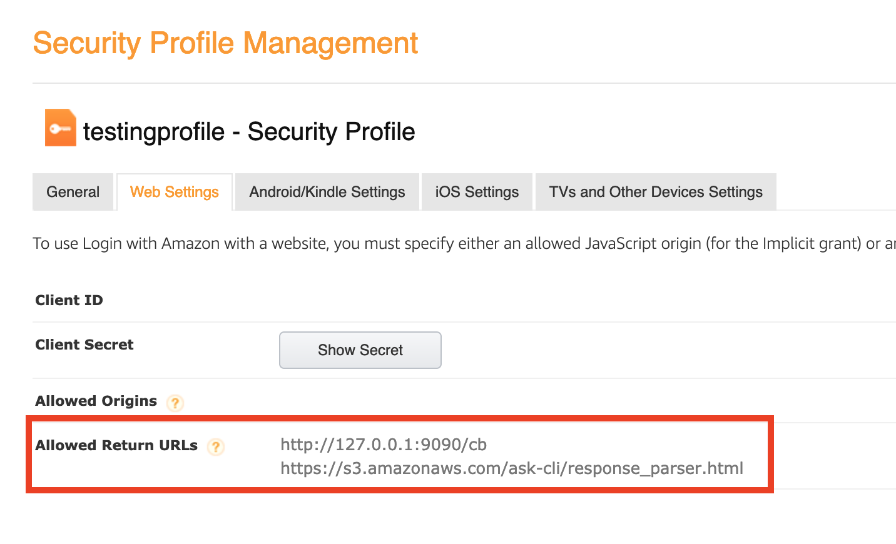
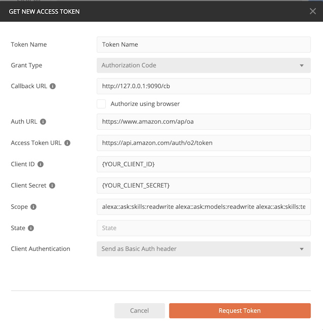

# The Alexa Skill


This is a CDK Pattern to deploy an Alexa Skill backed by a Lambda Function and a DynamoDB Table.

> NB: This is slightly more complicated than the normal patterns because Alexa is an Amazon product as opposed to an AWS one so you need to setup an Amazon Developer Account with permissions to deploy the skill

Some References:

| Author        | Link           |
| ------------- | ------------- |
| AWS | [Build An Engaging Alexa Skill](https://developer.amazon.com/en-US/alexa/alexa-skills-kit/get-deeper/tutorials-code-samples/build-an-engaging-alexa-skill) |
| AWS | [ASK CLI Docs](https://developer.amazon.com/en-US/docs/alexa/smapi/ask-cli-intro.html#create-new-skill) |
| AWS | [Starter Alexa Skill Code](https://developer.amazon.com/en-US/docs/alexa/alexa-skills-kit-sdk-for-nodejs/develop-your-first-skill.html) |
| AWS | [Implementing Persistent Storage In Your Fulfillment Lambda](https://developer.amazon.com/en-US/docs/alexa/alexa-skills-kit-sdk-for-nodejs/manage-attributes.html) |

## Prerequisites
Unfortunately these steps cannot be skipped or shortened as you need to configure an Amazon developer account and acquire an OAuth 2.0 Refresh token that allows you to deploy your skill using CloudFormation.

### 1. Create an [Amazon Developer account](https://developer.amazon.com/)
Alexa is an Amazon product even though it can be deployed through AWS you still need to have a separate [Amazon Developer account](https://developer.amazon.com/)
### 2. Create a [Developer Account Security Profile](https://developer.amazon.com/loginwithamazon/console/site/lwa/create-security-profile.html).

  Open the [Developer Account Security Profile](https://developer.amazon.com/loginwithamazon/console/site/lwa/create-security-profile.html) page and feel free to use whatever values you want for the Security Profile Name and Description. The Privacy Notice URL must be a valid URL format but does not need to be a valid URL. Once you create your security profile, navigate to the `Web Settings` tab and add the following as `Allowed Return URLs`:
   - `http://127.0.0.1:9090/cb`
   - `https://s3.amazonaws.com/ask-cli/response_parser.html`
   
### 3. Copy Your `Client Id` and `Client Secret` from the security profile
Keep these values safe as we will use them in a second.
### 4. Make Sure You Have An AWS Account with CLI Access
You will need this to deploy the CDK stack anyway but for the next step we need to associate Alexa with our AWS Account so this is crucial
### 5. Setup ASK CLI on your local machine
Alexa needs to associate your Amazon Developer Account with your AWS Account. The easiest way to do this is to run `ask configure` after you have installed the [Alexa Skills Kit CLI](https://developer.amazon.com/en-US/docs/alexa/smapi/quick-start-alexa-skills-kit-command-line-interface.html)
### 6. Generate a Refresh Token
We are going to use Postman to fetch a new `OAuth 2.0` token

Set the following key/values in the request:

| Field            | Value                                                                                                                                 |
|------------------|---------------------------------------------------------------------------------------------------------------------------------------|
| Grant Type       | Authorization Code                                                                                                                    |
| Callback URL     | http://127.0.0.1:9090/cb                                                                                                              |
| Auth URL         | https://www.amazon.com/ap/oa                                                                                                          |
| Access Token URL | https://api.amazon.com/auth/o2/token                                                                                                  |
| Client ID        | {YOUR_CLIENT_ID}                                                                                                                      |
| Client Secret    | {YOUR_CLIENT_SECRET}                                                                                                                  |
| Scope            | alexa::ask:skills:readwrite alexa::ask:models:readwrite alexa::ask:skills:test alexa::ask:catalogs:read alexa::ask:catalogs:readwrite |
|                  |                                                                                                                                       |


A Pop-Up should show up prompting you to log into your Developer account. Log in and you will be redirected to Postman where you should have a `refresh_token` to use in the next steps

### 7. Copy Your Vendor ID
Visit the [Customer Details Page](https://developer.amazon.com/settings/console/mycid) for your Amazon Developer Account and make a note of your "vendor ID"


## Before You Deploy
You need to add your ClientID, ClientSecret, Refresh Token and VendorID to the skill resource which can be found in `the-alexa-skill/typescript/lib/the-alexa-skill-stack.ts`
```
      vendorId: 'foo',
      authenticationConfiguration: {
        clientId: 'foo',
        clientSecret: 'bar',
        refreshToken: 'foobar'
      },
```

## How Do I Test This After Deployment?

1. Navigate to the Alexa Developer Console, or follow this link - https://developer.amazon.com/alexa/console/ask
2. If you see a skill named "CDK Patterns Sample" in your Alexa Skills list then it has successfully been uploaded! Now we just need to test the skill itself.
3. Select the CDK Patterns Sample skill by clicking on the name.
4. On the next page, select "Test" at the top of the screen. 
5. Amazon will ask if you'd to use your microphone or not. This is entirely optional as you may test Alexa using either voice commands or  the text box provided.
6. Change the "skill testing is enabled in:" option from "Off" to "Development" if needed.
7. Either type or say "CDK Patterns" (Case sensitive if typing) and wait for a response.
8. The response should be "Hey, it\'s Pancakes the CDK Otter here, what would you like to know?"
9. For further testing, either type or say "What patterns do you have?"
10. The response should be "I have many patterns for you to see! For example, there is" followed by three pattern names randomly picked from CDK Patterns.
11. Now we just need to confirm that it is interacting with DynamoDB correctly.
12. Go to the AWS Console and navigate to DynamoDB. Open your tables and find the one corresponding to TheAlexaSkillStack.
13. Confirm that one item is in the table (It should have 2 attributes and a UserID). If it does then congratulations! Everything works! 

## Useful CDK Commands

The `cdk.json` file tells the CDK Toolkit how to execute your app.

This project is set up like a standard Python project.  The initialization
process also creates a virtualenv within this project, stored under the .env
directory.  To create the virtualenv it assumes that there is a `python3`
(or `python` for Windows) executable in your path with access to the `venv`
package. If for any reason the automatic creation of the virtualenv fails,
you can create the virtualenv manually.

To manually create a virtualenv on MacOS and Linux:

```
$ python3 -m venv .env
```

After the init process completes and the virtualenv is created, you can use the following
step to activate your virtualenv.

```
$ source .env/bin/activate
```

If you are a Windows platform, you would activate the virtualenv like this:

```
% .env\Scripts\activate.bat
```

Once the virtualenv is activated, you can install the required dependencies.

```
$ pip install -r requirements.txt
```

At this point you can now synthesize the CloudFormation template for this code.

```
$ cdk synth
```

To add additional dependencies, for example other CDK libraries, just add
them to your `setup.py` file and rerun the `pip install -r requirements.txt`
command.

## Useful commands

 * `cdk ls`          list all stacks in the app
 * `cdk synth`       emits the synthesized CloudFormation template
 * `cdk deploy`      deploy this stack to your default AWS account/region
 * `cdk diff`        compare deployed stack with current state
 * `cdk docs`        open CDK documentation

Enjoy!